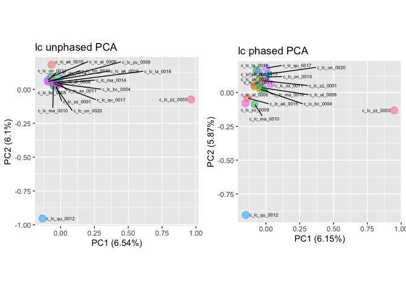
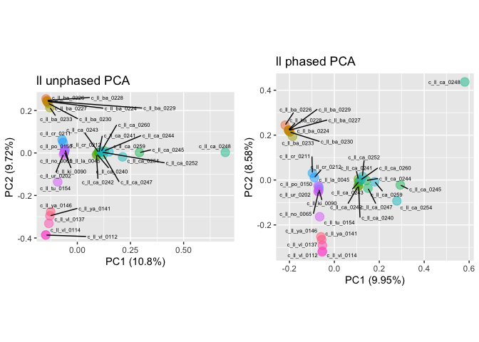
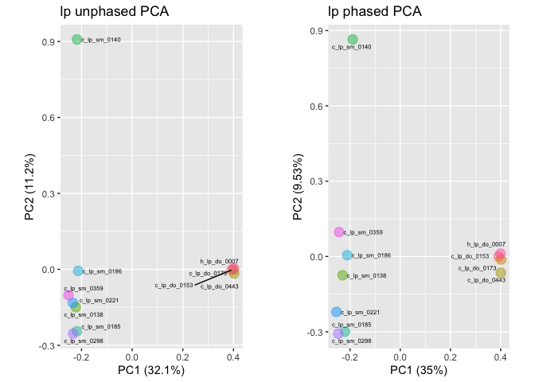
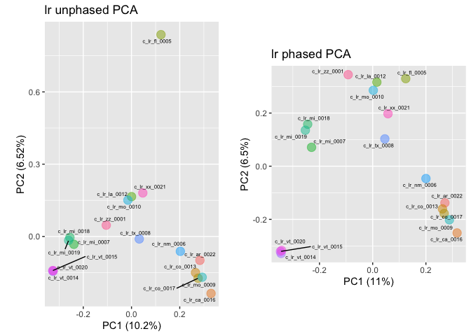

Principal component analyses on lynx data
================
Lorena Lorenzo
28-Sep-2023

``` bash
###PCA
#Repeat plink per sp.
species=(lc ll lp lr)

for i in ${species[@]}
  do
    VCF=/home/llorenzo/vcf_filtering/${i}_goodsamples_filtered_phased_polarized_variants_header_cat_ref.vcf
    # perform linkage pruning - i.e. identify prune sites
    plink_1.9 --vcf $VCF --double-id --allow-extra-chr \
    --set-missing-var-ids @:# \
    --indep-pairwise 50 10 0.1 --out ${i}_subset.tmp
    #run PCA in the subset
    plink_1.9 --vcf $VCF --double-id --allow-extra-chr --set-missing-var-ids @:# \
    --extract ${i}_subset.tmp.prune.in \
    --make-bed --pca --out ${i}_goodsamples_filtered_phased_polarized_cat_ref
  done

rm *tmp
```

``` r
#Set dependencies (libraries, paths, variables)
library(tidyverse)
library(viridis)
library(ggrepel)

species<- c("lc", "ll", "lp", "lr")
path <- "../files/PCA/"

options(ggrepel.max.overlaps = Inf)

##PREPHASED PCAs##
for (sp in species)
{
  #Read pre-phased data
  # import eigen vec and val
pca <- read_table(paste0(path, sp, "_goodsamples_cat_ref.eigenvec"),
                   col_names = FALSE)
eigenval <- scan(paste0(path, sp, "_goodsamples_cat_ref.eigenval"))  

# remove nuisance column
pca <- pca[,-1]
# set names
names(pca)[1] <- "ind"
names(pca)[2:ncol(pca)] <- paste0("PC", 1:(ncol(pca)-1))

# first convert to percentage variance explained
pve <- data.frame(PC = 1:(ncol(pca)-1), pve = eigenval/sum(eigenval)*100)
# then make a plot
unphased_variance <- ggplot(pve, aes(PC, pve)) +
                  geom_bar(stat = "identity") +
                  ylab("Percentage variance explained") + 
                  theme_light()

# plot PC1 PC2
unphased_pca<- ggplot() +
                geom_point(pca, mapping=aes(x= PC1, y= PC2, color=ind) , size=4, alpha = 0.5) +
                geom_text_repel(pca, mapping=aes(x= PC1, y= PC2, label=ind), size=2, show.legend = TRUE) +
                coord_equal() +
                labs (title= paste0(sp, " unphased PCA") , x= paste0("PC1 (", signif(pve$pve[1], 3), "%)"), y= paste0("PC2 (", signif(pve$pve[2], 3), "%)")) +
                theme(legend.title = element_blank(), legend.position ="none")


assign(paste0(sp, "_unphased_pca"), unphased_pca)
}

##PHASED PCAs##
for (sp in species)
{
#Read phased data
pca <- read_table(paste0(path, sp, "_goodsamples_filtered_phased_polarized_cat_ref.eigenvec"),
                   col_names = FALSE)
eigenval <- scan(paste0(path, sp, "_goodsamples_filtered_phased_polarized_cat_ref.eigenval"))


# remove nuisance column
pca <- pca[,-1]
# set names
names(pca)[1] <- "ind"
names(pca)[2:ncol(pca)] <- paste0("PC", 1:(ncol(pca)-1))


# first convert to percentage variance explained
pve <- data.frame(PC = 1:(ncol(pca)-1), pve = eigenval/sum(eigenval)*100)
# then make a plot
phased_variance <- ggplot(pve, aes(PC, pve)) +
        geom_bar(stat = "identity") +
        ylab("Percentage variance explained") + 
        theme_light()


# plot PC1 PC2
phased_pca <- ggplot() +
                geom_point(pca, mapping=aes(x= PC1, y= PC2, color=ind) , size=4, alpha = 0.5) +
                geom_text_repel(pca, mapping=aes(x= PC1, y= PC2, label=ind), size=2, show.legend = TRUE) +
                coord_equal() +
                labs (title= paste0(sp, " phased PCA") , x= paste0("PC1 (", signif(pve$pve[1], 3), "%)"), y= paste0("PC2 (", signif(pve$pve[2], 3), "%)")) +
                theme(legend.title = element_blank(), legend.position ="none")
                


assign(paste0(sp, "_phased_pca"), phased_pca)
}
## customize
lc <- ggpubr::ggarrange(lc_unphased_pca, lc_phased_pca)
ll <- ggpubr::ggarrange(ll_unphased_pca, ll_phased_pca)
lp <- ggpubr::ggarrange(lp_unphased_pca, lp_phased_pca)
lr <- ggpubr::ggarrange(lr_unphased_pca, lr_phased_pca)

print(lc)
```

<!-- -->

``` r
print(ll)
```

<!-- -->

``` r
print(lp)
```

<!-- -->

``` r
print(lr)
```

<!-- -->
