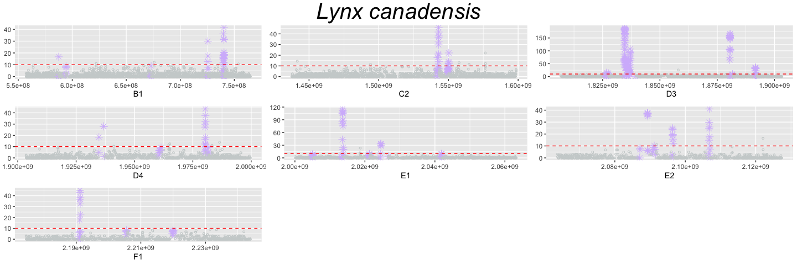
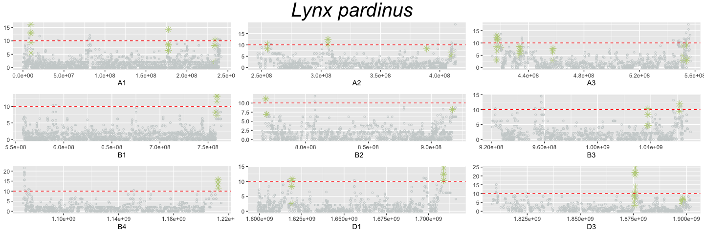
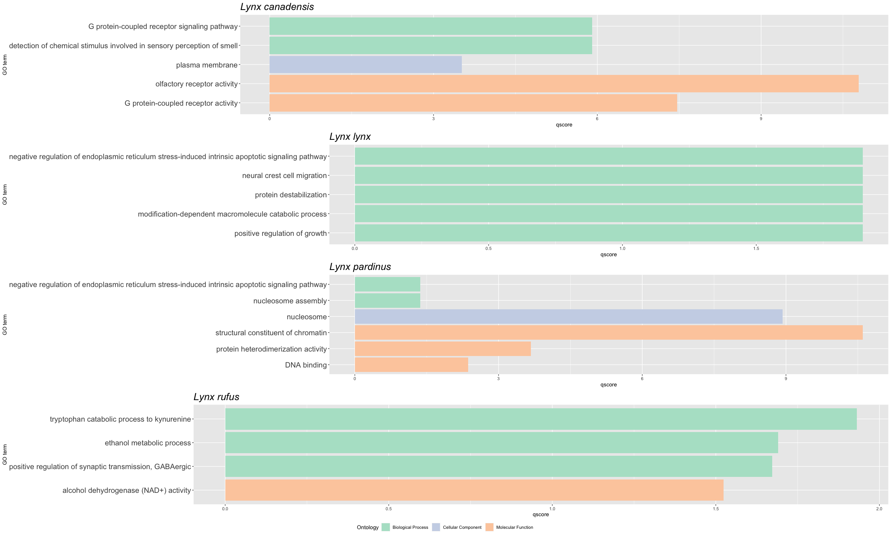

Positive selection genomic scan on lynxes
================
Lorena Lorenzo
27-Sep-2023

## 1. Genomic scan methods

The aim of this chapter is to make an approach into positive selection
among lynxes species through genomic scan methods. After an exhaustive
revision of the state of art, we decided to focus on two footprints of
positive selection across genome:

1.  Extended Haplotype Homozigosity

2.  Haplotype Frequency Spectrum Distortion

### 1.1 Data set-up

Once I have filtered, phased and polarized data (see
variant_filtering.md , phasing.md or polarization.md), I can start with
selection analyses. For this step I am going to use both phased and
non-phased vcfs (phased with iHS analyses and non-phased with
saltiLASSI). Those files are:

`${sp}_goodsamples_filtered_phased_polarized_variants_header_cat_ref.vcf`

`${sp}_goodsamples_filtered_polarized_variants_header_cat_ref.vcf`

Moreover, after phasing, allele count is not recalculated so that I used
the following code for updating INFO field.

``` bash
species=(lc ll lp lr)

for sp in ${species[@]}
do
cat ${sp}_goodsamples_filtered_phased_polarized_variants_header_cat_ref.vcf | fill-an-ac | bgzip -c > ${sp}_goodsamples_filtered_phased_polarized_variants_header_cat_ref.vcf.gz
done
```

Both methods of selection need to be run per chr

``` bash

#Separate per chr sp vcf
species=(lc ll lp lr)

for sp in ${species[@]}
do
  echo "$sp"
  CHR=($(cat $STORE2/reference_genomes/Felis_catus_Ref/Felis_catus.Felis_catus_9.0.dna.toplevel.fa.fai | cut -f 1 | uniq))
  for chr in ${CHR[@]:0:18}
    do
      echo "$chr"
      grep -E "^(#|${chr})" \
      $INPUT_FILE \
      > $OUTPUT_FILE
      echo "Done $chr for $sp vcf"
    done
done
```

#### 1.1.1. Control check: exploring missingness per sp

Code available in missing_distribution.R and missing_distribution.sh

``` bash

for sp in ${species[@]}
  do
    echo "$sp"
    vcftools \
    --vcf ${sp}_goodsamples_cat_ref.filter8.vcf \
    --missing-site \
    --out ${sp}_missing_site_rate
  done
  
  bcftools query -f '%CHROM %POS  %REF  %ALT [ %GT]\n' lr_goodsamples_cat_ref.filter8.vcf > lr_genotypes_cat_ref.filter8.vcf
```

### 1.2 iHS analyses

For iHS analyses we decided to use the “rehh” package available for R.
The entire code is available in ihs_sp.R. To run this in CESGA, I had to
create a run_ihs.sh script that specify to run the Rscript.

``` r
#!/usr/bin/env Rscript

print ("Starting ihs analysis")

#If run in CESGA, install packages before running the code in sbatch
  #install.packages("vcfR")
  #install.packages("rehh")
  #The downloaded source packages are in ‘/tmp/Rtmp7TLpRA/downloaded_packages’
  library(vcfR)
  library(rehh)

#ENABLE command line arguments
sp <- commandArgs(trailingOnly = TRUE)

#sp<- c("lc", "ll", "lp", "lr") ###if I don't run the entire code
#Create a df object empty
df_total <- data.frame()

#Define chromosome variable
chromosomes <- c("A1", "A2", "A3", "B1", "B2", "B3", "B4", "C1", "C2", "D1", "D2", "D3", "D4", "E1", "E2", "E3", "F1", "F2")

#Define paths
input_path<- "/mnt/lustre/scratch/nlsas/home/csic/bie/llf/selection_scan/chr_files/"
output_path<- "/mnt/lustre/scratch/nlsas/home/csic/bie/llf/selection_scan/iHS/"

#loop to bind each chr_sp_scan df in only one
for (chr in chromosomes)
{
  print("Starting loop")
 
  
  #Read the subsetted vcf    
  print ("Reading vcf")  
  data<- data2haplohh(hap_file=paste0(input_path, chr, "_", sp, "_","goodsamples_filtered_phased_polarized_variants_header_cat_ref.vcf"), polarize_vcf= "FALSE", allele_coding="01", chr.name=chr, vcf_reader= "vcfR")
  
  #Scan the genome 
  print ("Scanning vcf")  
  data_frame<- scan_hh(data) 
  write.table(data_frame, file=(paste0(output_path, chr, "_", sp, "_", "scan")))
  print ("Saved scan data frame")
  
  df<- read.csv(paste0(output_path, chr, "_", sp, "_", "scan"), sep=" ")
  df_total<- rbind(df_total,df)
  print("Added one more chr in the total df")
}

#Save the sp_scan
write.table(df_total, file=(paste0(output_path, sp, "_scan")), sep="\t", row.names = FALSE, quote = FALSE)

#Calculate genome-wide iHS values
print ("Calculating ihs") 
wgscan.ihs<- ihh2ihs(df_total, (round((min(df_total$FREQ_A) * 2), 2))) 
write.table(wgscan.ihs$ihs, file=(paste0(output_path, sp, "_ihs_scan")), sep="\t", row.names = FALSE, quote = FALSE)
print ("Saved ihs data frame")
```

### 1.2 XP-EHH analyses

As with iHS, I used rehh R package. The entire code is available in
xpehh_sp.R. To run this in CESGA, I had to create a run_xpehh.sh script
that specify to run the Rscript.

``` r
#!/usr/bin/env Rscript

print ("Starting xpehh analysis")

#install.packages("vcfR")
#install.packages("rehh")
library(vcfR)
library(rehh)

#Define paths
path<- "/mnt/lustre/scratch/nlsas/home/csic/bie/llf/selection_scan/iHS/"

#Name variables
species<- c("lc", "ll", "lp", "lr")

#Read per sp scan
  for(sp in species) 
    {
    print(paste("Reading", sp, "scan"))
    scan<- read.csv(paste0(path, sp, "_scan"), sep="\t")
    assign(paste0(sp, "_scan"), scan)
  }

#Calculating XP-EHH
print ("Calculating xpehh") 

lc_ll_xpehh <- ies2xpehh(scan_pop1 = lc_scan, scan_pop2 = ll_scan, popname1 = "LC", popname2 = "LL", p.adjust.method = "fdr")
write.table(lc_ll_xpehh, file=(paste0(path, "lc_ll_xpehh_scan")), sep="\t", row.names = FALSE, quote = FALSE)

lc_lp_xpehh <- ies2xpehh(scan_pop1 = lc_scan, scan_pop2 = lp_scan, popname1 = "LC", popname2 = "LP", p.adjust.method = "fdr")
write.table(lc_lp_xpehh, file=(paste0(path, "lc_lp_xpehh_scan")), sep="\t", row.names = FALSE, quote = FALSE)


lc_lr_xpehh <- ies2xpehh(scan_pop1 = lc_scan, scan_pop2 = lr_scan, popname1 = "LC", popname2 = "LR", p.adjust.method = "fdr")
write.table(lc_lr_xpehh, file=(paste0(path, "lc_lr_xpehh_scan")), sep="\t", row.names = FALSE, quote = FALSE)


ll_lp_xpehh <- ies2xpehh(scan_pop1 = ll_scan, scan_pop2 = lp_scan, popname1 = "LL", popname2 = "LP", p.adjust.method = "fdr")
write.table(ll_lp_xpehh, file=(paste0(path, "ll_lp_xpehh_scan")), sep="\t", row.names = FALSE, quote = FALSE)


ll_lr_xpehh <- ies2xpehh(scan_pop1 = ll_scan, scan_pop2 = lr_scan, popname1 = "LL", popname2 = "LR", p.adjust.method = "fdr")
write.table(ll_lr_xpehh, file=(paste0(path, "ll_lr_xpehh_scan")), sep="\t", row.names = FALSE, quote = FALSE)


lp_lr_xpehh <- ies2xpehh(scan_pop1 = lp_scan, scan_pop2 = lr_scan, popname1 = "LP", popname2 = "LR", p.adjust.method = "fdr")
write.table(lp_lr_xpehh, file=(paste0(path, "lp_lr_xpehh_scan")), sep="\t", row.names = FALSE, quote = FALSE)
```

### 1.3. salti-LASSI

Here I am going to use saltiLASSI to analyse selection from haplotype
frequency spectrum (HFS). I used windows of 101 SNPS with a 50 slide.
The entire code is available in lassi.sh.

``` bash

species=(lc ll lp lr)

for sp in ${species[@]}
  do
    echo "$sp"
    #make a sp_ind.txt (pop file) needed for lassip
    sed "s/$/\t${sp}/" <(grep "#CHR" $LUSTRE/${sp}_goodsamples_filtered_phased_polarized_variants_header_cat_ref.vcf | tr "\t" "\n" | grep ${sp})  > $LUSTRE/selection_scan/${sp}_ind.txt
    sbatch lassi.sh $sp
  done  
  
species=(lc ll lp lr)

for sp in ${species[@]}
  do
  sbatch lassi.sh $sp
  done
```

## 2. Results

### 2.1 Representation of iHS and salti-LASSI results

For graphics we are going to use R. First thing is to run packages
needed and set directories.

``` r
#install.packages
library(tidyverse)
library(rehh)
library(RColorBrewer)
library(cowplot)
library(ggpubr)
library(grid)
library(ggrepel)

#Set directories
path<- "/Users/lorenalorenzo"
files<- "/files/"
plots<- "/plots/"

#Name the variables
species<- c("lc", "ll", "lp", "lr")

names <- c("lc" = "Lynx canadensis",
            "lr" = "Lynx rufus",
            "ll" = "Lynx lynx",
            "lp" = "Lynx pardinus")

chr <- c( "A1", "A2", "A3", "B1", "B2", "B3", "B4", "C1", "C2", "D1", "D2", "D3", "D4", "E1", "E2", "E3", "F1", "F2", "X")

colors <- c("lc"= "#AB97B7",
            "ll"= "#F2AB5A",
            "lp"="#EB595F",
            "lr"="#71C178")
#print(as.character(names[species]))
#print(as.character(colors[species]))

#set X axis with chr_size dataframe (for plotting)
    axis_set <- read.table(paste0(path, files, "chr_size.txt"), sep="\t", col.names=c("chr", "size")) %>%
                 mutate(center = size/2)
    #Group by chr
    data_axis <- axis_set %>%
                  mutate(size_cum = lag(cumsum(as.numeric(size)), default = 0)) %>%
                  rowwise() %>%
                  mutate(center_cum = sum(center, size_cum))     
```

In the following code I prepare iHS and saltiLASSI results for
representation with cutoffs.

``` r
for (sp in species)
{

# iHS results -------------------------------------------------------------
  ihs_scan <- read.table(paste0(path, files, sp , "_ihs_scan"), sep="\t", header= TRUE, col.names = c("chr", "pos", "ihs", "pval"))
  print("Read ihs_scan data")
  
  #Group by chr
  data_cum <- ihs_scan %>% 
    group_by(chr) %>% 
    summarise(max_bp = max(pos)) %>%
    mutate(bp_add = lag(cumsum(max_bp), default = 0)) %>% 
    select(chr, bp_add)
  
  data_ihs <- ihs_scan %>% 
    inner_join(data_cum, by = "chr") %>% 
    mutate(bp_cum = pos + bp_add) %>%
    na.omit() %>%
    mutate(abs_ihs= abs(ihs)) %>% #absolute value score of iHS
    mutate (dataset="|iHS|")  #for facet_grid
  
  axis_set <- data_ihs %>% 
    group_by(chr) %>% 
    summarize(center = mean(bp_cum))
  
  print("Data set")
    
write.table(data_ihs, file=(paste0(path, files, sp, "data_ihs")), sep="\t", row.names = FALSE, quote = FALSE)
  
  #explore ihs distribution (gaussian)
  # pdf(paste0(path, plots, sp,"_distplot.pdf"), width=10, height=5)
  # distribplot(ihs_scan$IHS, xlab= paste(sp, "iHS"), qqplot = TRUE)
  #dev.off()
  
## define outliers ----------------------------------------------------------------
  
  ihs_outliers<- data_ihs %>% filter(abs_ihs >= 4)
  print(length(ihs_outliers$abs_ihs))
  
  write.table(ihs_outliers, file=(paste0(path, files, sp, "_ihs_4outliers")), sep="\t", row.names = FALSE, quote = FALSE)
  print("outliers df saved")
  
  #Save as 0-based bed file
 bed_4 <- ihs_outliers %>% mutate(start= pos - 1) %>% select(c(1,9,2,3,7))
 write.table(bed_4, file=(paste0(path, files, sp, "_ihs_4outliers.bed")), sep="\t", row.names = FALSE, col.names = FALSE, quote = FALSE)

  
# saltiLASSI results -----------------------------------------------------------
  print("Starting plotting LASSI results code")

  #Read data
  lassi_scan<- read.table(paste0(path, files, sp, "_salti.lassip.hap.out"), sep="\t", header=T)
  print(paste("Read data for", sp))
  
  #Group by chr
  data_cum <- lassi_scan %>% 
    group_by(chr) %>% 
    summarise(max_bp = max(pos)) %>%
    mutate(bp_add = lag(cumsum(max_bp), default = 0)) %>% 
    select(chr, bp_add)
  
  data_lassi <- lassi_scan %>% 
    inner_join(data_cum, by = "chr") %>% 
    mutate(bp_cum = pos + bp_add) %>%
    mutate(dataset="saltiLASSI")
  
  axis_set <- data_lassi %>% 
    group_by(chr) %>% 
    summarize(center = mean(bp_cum))
  
  print("Acumulated by chr")
  
  
  #Change the "sp_L" column name to another in order to make it easier to manage
  colnames(data_lassi)[12]<- "statistic"
  
  print("rename sp_L column to statistic")
  
  write.table(data_lassi, file=(paste0(path, files, sp, "data_lassi")), sep="\t", row.names = FALSE, quote = FALSE)
  
  #Explore statistic distribution
    #pdf(paste0(path, plots, sp,"_L_statistic_distplot.pdf"), width=10, height=5)
  
    #print(ggplot(data_lassi, aes(x= statistic)) +
         # geom_freqpoly(binwidth=10) + 
         # ylim(0, 20000) +
        #  labs (title=sp))
  
   #dev.off()
  
    #print("distribution plot saved")
  
## define outliers ---------------------------------------------------------
  #cut-off 95%
  print(paste(sp, round(length(data_lassi$statistic) * 0.05), "top 5% values"))
  cut_95 <- sort(data_lassi$statistic)[round(length(data_lassi$statistic) * 0.95)]
  print(paste(sp, cut_95, "5% cut-off" ))
  
  lassi_outliers_95<- data_lassi %>% filter(statistic >= cut_95)
  write.table(lassi_outliers_95, file=(paste0(path, files, sp, "_lassi_5%outliers")), sep="\t", row.names = FALSE, quote = FALSE)
  print("outliers df saved")
  
  bed_95 <- lassi_outliers_95  %>% select(c(1,2,3,12))
  write.table(bed_95, file=(paste0(path, files, sp, "_lassi_5%outliers.bed")), sep="\t", row.names = FALSE, col.names = FALSE, quote = FALSE)
}  
```

    ## [1] "Read ihs_scan data"
    ## [1] "Data set"
    ## [1] 2992
    ## [1] "outliers df saved"
    ## [1] "Starting plotting LASSI results code"
    ## [1] "Read data for lc"
    ## [1] "Acumulated by chr"
    ## [1] "rename sp_L column to statistic"
    ## [1] "lc 1424 top 5% values"
    ## [1] "lc 5.76722 5% cut-off"
    ## [1] "outliers df saved"
    ## [1] "Read ihs_scan data"
    ## [1] "Data set"
    ## [1] 693
    ## [1] "outliers df saved"
    ## [1] "Starting plotting LASSI results code"
    ## [1] "Read data for ll"
    ## [1] "Acumulated by chr"
    ## [1] "rename sp_L column to statistic"
    ## [1] "ll 3080 top 5% values"
    ## [1] "ll 23.5728 5% cut-off"
    ## [1] "outliers df saved"
    ## [1] "Read ihs_scan data"
    ## [1] "Data set"
    ## [1] 1625
    ## [1] "outliers df saved"
    ## [1] "Starting plotting LASSI results code"
    ## [1] "Read data for lp"
    ## [1] "Acumulated by chr"
    ## [1] "rename sp_L column to statistic"
    ## [1] "lp 865 top 5% values"
    ## [1] "lp 6.53881 5% cut-off"
    ## [1] "outliers df saved"
    ## [1] "Read ihs_scan data"
    ## [1] "Data set"
    ## [1] 3880
    ## [1] "outliers df saved"
    ## [1] "Starting plotting LASSI results code"
    ## [1] "Read data for lr"
    ## [1] "Acumulated by chr"
    ## [1] "rename sp_L column to statistic"
    ## [1] "lr 8763 top 5% values"
    ## [1] "lr 10.0232 5% cut-off"
    ## [1] "outliers df saved"

<!-- -->

### 2.2 Intersect between methods

Once saved the outliers bed from iHS and saltiLASSI, we need the overlap
of both methods. For doing that, here we are using bedtools. Firstly, I
merge every overlapping outlier window from lassi. Then, we intersect
this windows with the outlier SNPs from iHS to get putative selected
genomic REGIONS. Use 5% as cutoff for lassi because after that we are
going to rank 10 best regions.

``` bash
module load bedtools

species=(lc ll lp lr)

for sp in ${species[@]}
  do
    echo "$sp"
       #merge every overlapping outlier window in LASSI 
       bedtools merge \
       -i ${sp}_lassi_5%outliers.bed \
       -c 1 \
       -o count \
       > ${sp}_merged_tmp
       echo "$sp merged"
       
       #intersect with iHS snps so the result are GENOMIC REGIONS under putative selection
       bedtools intersect \
       -a ${sp}_merged_tmp \
       -b ${sp}_ihs_4outliers.bed \
       -c \
       > ${sp}_intersected_tmp
       echo "$sp intersected"
       
       #add snp density        
       bedtools intersect \
       -a ${sp}_intersected_tmp \
       -b $LUSTRE/vcfs/${sp}_goodsamples_filtered_phased_polarized_variants_header_cat_ref.vcf \
       -c \
     > ${sp}_snps_density_tmp
     
       #calculate lassi values for those regions
       bedtools map \
       -a ${sp}_snps_density_tmp\
       -b ${sp}_lassi_5%outliers.bed \
       -F 1 \
       -c 4 \
       -o mean,max,sum \
       > ${sp}_lassi_tmp
       echo "$sp lassi statistics calculated"
       
       #calculate iHS values for those regions
       bedtools map \
       -a ${sp}_lassi_tmp \
       -b ${sp}_ihs_4outliers.bed \
       -F 1 \
       -c 5 \
       -o mean,max,sum \
       > ${sp}_lassi_ihs_tmp
       echo "$sp ihs statistics calculated"
       
       #remove 0's (no SNPS)
       awk -F '\t' '$5 != 0' ${sp}_lassi_ihs_tmp > ${sp}_lassi_ihs_regions_tmp
       echo "$sp regions with 0 snps intersected removed"
       
       #print a header (column names)
       echo -e "chr start end windows snps snps_density lassi_mean lassi_max lassi_sum ihs_mean ihs_max ihs_sum" | cat - ${sp}_lassi_ihs_regions_tmp | tr " " "\t" > ${sp}_lassi_ihs_regions 
       
  ######Cross bed results with annotation file (gff3)    
      #match selected regions with genome annotation
       bedtools intersect \
         -a ${sp}_lassi_ihs_regions_tmp \
         -b $STORE2/reference_genomes/Felis_catus_Ref/Felis_catus.Felis_catus_9.0.97.gff3 \
         -wa -wb \
         > ${sp}_annotated_tmp 
        echo "$sp annotated"
        
      #filter only genes
      awk '$15=="gene"' ${sp}_annotated_tmp > ${sp}_gene_tmp
      echo "$sp gene filtered"
    
    #get only interesting columns
    cut -f-12,16,17,21- ${sp}_gene_tmp | tr ' ' '\t' > ${sp}_filtered_tmp
    
    #ensembl id and gene name as column data
    cut -d';' -f1,2 ${sp}_filtered_tmp | tr ';' '\t'  | awk '{if ($16 ~ /Name=[[:alnum:]]/) $16=$16; else $16="NA"; print $0}' > ${sp}_names_tmp 
    
    #cut extra-info from ens code and gene name columns
    paste <(cut -d" " -f-14 ${sp}_names_tmp) <(cut -d" " -f15 ${sp}_names_tmp | cut -d":" -f2) <(cut -d" " -f16 ${sp}_names_tmp | cut -d"=" -f2) |  tr "\t" " "  >> ${sp}_columns_tmp
    
    #print a header (column names)
    echo -e "chr start end windows snps snps_density lassi_mean lassi_max lassi_sum ihs_mean ihs_max ihs_sum gene_start gene_end ensembl_id gene_name" | cat - ${sp}_columns_tmp > ${sp}_genomic_regions_annotated
      
        #remove temporal files
       rm *tmp
    done
```

### 2.3 Representation of the intersection

For representation purposes, I want to merge lassi outliers windows data
with intersected outilies regions data.

``` bash
module load bedtools

species=(lc ll lp lr)

#Merge info about lassi results and the final table of genomics regions under selection
for sp in ${species[@]}
  do
    echo "$sp"
    bedtools intersect \
    -a <(grep -v "chr" saltiLASSI/${sp}_salti.lassip.hap.out | cut -f1,2,3,5,12) \
    -b <(grep -v "chr" ${sp}_5%outliers_table) \
    -wao \
    > ${sp}_results_table_representation
  done  
```

    ## [1] "lc 1424 top 5% values"
    ## [1] "lc 5.76722 5% cut-off"
    ## [1] "ll 3080 top 5% values"
    ## [1] "ll 23.5728 5% cut-off"
    ## [1] "lp 865 top 5% values"
    ## [1] "lp 6.53881 5% cut-off"
    ## [1] "lr 8763 top 5% values"
    ## [1] "lr 10.0232 5% cut-off"

<!-- -->

CLARIFICATION: In the plot we can see \* below the cutoff. That’s
because another overlapping window passed the cutoff value, so now the
region includes windows that by its own didn’t were outliers.

Now I want to explore regions defined in a chr

<!-- --><!-- --><!-- --><!-- -->

### 2.3 Representation of XP-EHH

<!-- --><!-- --><!-- --><!-- --><!-- --><!-- -->

## 3. Interpretation

### 3.1 Looking for enrichment pathways

We tried to find out pathways or functions specifically being under
selection pressure among the putative selected regions (those
overpassing the filter for both methods). Unfortunately, GO enrichment
analyses done in PANTHER results in no enrichment pathway in no species.

### 3.2 Top regions

As we didn’t get any significant result in the enrichment analyses, we
decided to look for the most important regions under selection in each
species. For doing so, we had to decided what parameter describes better
which regions are “the most important ones”.

From the resulting table I get the top 10 putative regions per sp.

``` r
#Read data
for (sp in species)
{
data<- read.table(paste0(path, files, sp, "_lassi_ihs_regions"), sep="\t", header=T)
assign(paste0(sp, "_results"), data )

data_top10<- data %>%
  arrange(desc(lassi_max)) %>%
  slice(1:10)
#write.table(data_top10, file=(paste0(path, files, sp, "_top10")), sep="\t",row.names = FALSE, quote = FALSE)

assign(paste0(sp, "_top10"), data_top10 )
}
```

In order to explore the distribution of the lassi statistic in each of
the 10 top regions, I firstly get the statistic value in every window of
the top region and then represent it.

``` bash
module load bedtools

species=(lc ll lp lr)

for sp in ${species[@]}
  do
    echo "$sp"
    #convert into a bed file
    awk '{printf("%s\t%d\t%d\t%d\t%d\n", $1, $2, $3, $5, $12)}' saltiLASSI/${sp}_salti.lassip.hap.out  > ${sp}_tmp

    #intersect btw lassi values and genomic regions with 100% coincidence (only windows embedded in the genomic regions are reported)
       bedtools intersect -wa -wb \
       -a <(grep -v "chr" ${sp}_tmp) \
       -b <(grep -v "chr" ${sp}_top10 | cut -f1-3) \
       -f 1.0 \
       > ${sp}_lassi_top10  
       echo "$sp intersected"
    
  #remove temporal files
  rm *tmp
  done
```

Now I want to represent each top10 genomic regions and the correspondent
lassi values. Taking into account I previously calculated the genes
under the genomic outlier regions, we can add this info to the plot

<!-- --><!-- --><!-- --><!-- -->

<!-- -->
